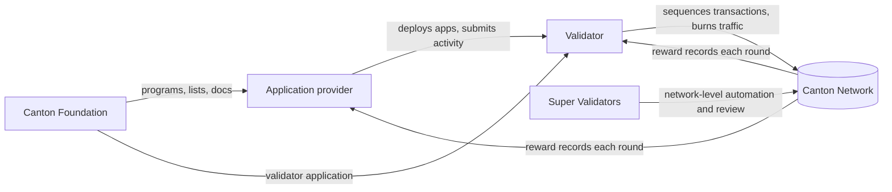

# Ecosystem and roles

A short orientation to who participates in the Canton Network and how the roles
relate. This is the business context that makes the technical tracks easier to
follow.

## The main roles

- Application providers (app builders): teams that build applications on Canton,
  such as wallets, asset issuers, exchanges, and other services. They generate
  on-chain activity and can earn app rewards when featured. This is the
  [development track](../development/daml-and-api-index.md).
- Validators: operators that run nodes, host parties, and submit transactions.
  They provide the infrastructure the network runs on and earn validator-side
  rewards. This is the [infrastructure track](../infrastructure/validator-onboarding.md).
- Super Validators (SVs): operators that run the Global Synchronizer and
  additional network-level responsibilities and automation. Governance is
  exercised by the set of Super Validators under a supermajority threshold. This
  repo refers to them only generically and never names specific ones; consult the
  public list when you need to identify a sponsor.
- The Global Synchronizer Foundation (GSF): governs the Global Synchronizer
  through Super Validators and Canton Improvement Proposals (CIPs); it is managed
  by the Linux Foundation. Proposals are published at
  [github.com/canton-foundation/cips](https://github.com/canton-foundation/cips).
- The Canton Foundation: stewards ecosystem programs, including the public
  validator application and the featured-app request process, and publishes the
  authoritative lists and documentation.

## How the roles interact

## The network underneath

Parties are hosted on participant nodes, which run the Daml interpreter and store
contracts privately. Participants connect to synchronizers, which order, persist,
and deliver encrypted messages via a per-transaction BFT consensus protocol,
producing a virtual global ledger with sub-transaction privacy. The default,
decentralized synchronizer is the Global Synchronizer. Supporting components
include sequencers (ordering/persistence), mediators (confirmation aggregation),
and Scan (the public read API and UI).

## Where value comes from

At a high level, network usage burns value through traffic fees, and
participants receive the right to mint Canton Coin based on the utility they
provide. Application activity, validator operation, and super-validator duties
each have their own reward path. The mechanics are covered in
[tokenomics-overview.md](tokenomics-overview.md).

## Getting started by goal

- I want to build an app: start with the
  [development track](../development/daml-and-api-index.md) and the
  [featured-app program](featured-app-program.md).
- I want to run infrastructure: start with
  [validator onboarding](../infrastructure/validator-onboarding.md).
- I want to contribute to the ecosystem (funded or open source): see
  [Canton Development Fund](canton-development-fund.md) and
  [contributing to Canton](../development/contributing-to-canton.md).

## Related

- [Featured app program](featured-app-program.md)
- [Tokenomics overview](tokenomics-overview.md)
