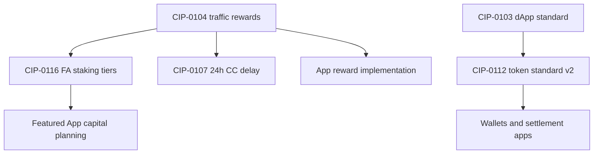

# Substantive CIPs for builders

Deep summaries of **protocol, tokenomics, and standards** CIPs that change how
you build on Canton — newest first. This page **excludes** “Add X as SV of weight
N” governance entries and SV-weight-mechanics CIPs (0105, 0111, 0114). For the
full numbered index including SV grants, see [cip-index.md](cip-index.md).

**Repo:** [github.com/canton-foundation/cips](https://github.com/canton-foundation/cips)
is the current home (`/blob/main/cip-00NN/cip-00NN.md`). An older mirror exists
under `global-synchronizer-foundation/cips`; prefer canton-foundation for new work.

**Discussion:** [lists.sync.global/g/cip-discuss](https://lists.sync.global/g/cip-discuss)

---

## CIP-0116 — Featured App staking (Tokenomics, proposed 2026-05-06)

[CIP-0116](https://github.com/canton-foundation/cips/blob/main/cip-0116/cip-0116.md)

Introduces **per-`PartyId` CC locking** as the requirement for Featured App (FA)
status, shifting away from Foundation discretion toward an on-chain market
mechanism.

**Stages**

1. **On passing (immediate):** flat **25,000,000 CC** lock per `PartyId`,
   following the pre–CIP-0104 marker-era mechanics.
2. **After [CIP-0104](https://github.com/canton-foundation/cips/blob/main/cip-0104/cip-0104.md)
   goes live — tiered locks:**
   - **Tier 1:** **1,000,000 CC** locked **30 days** → reward cap about **$0.80**
     per unit of weight.
   - **Tier 2:** **5,000,000 CC** locked **365 days** → reward cap about
     **$1.50** per unit of weight.

**SV reuse sunset:** Super Validators may initially reuse **SV-locked CC** to
back apps, but that reuse **ends 90 days after CIP-0104 go-live**; apps then need
**unencumbered** CC.

**Enforcement:** continuous — falling below threshold **removes FA status
immediately**. SV operators must action an **unfeature vote within 30 minutes**.

**Builder impact:** if you plan a Featured App, model **capital lock-up** and
tier choice alongside
[CIP-0104](https://github.com/canton-foundation/cips/blob/main/cip-0104/cip-0104.md)
traffic-based rewards. See
[featured-app-program.md](../business/featured-app-program.md).

---

## CIP-0112 — Canton Network Token Standard V2 (Standards, draft 2026-03-31)

[CIP-0112](https://github.com/canton-foundation/cips/blob/main/cip-0112/cip-0112.md)

Backwards-compatible evolution of [CIP-0056](https://github.com/canton-foundation/cips/blob/main/cip-0056/cip-0056.md),
aimed at traditional settlement venues and multi-tier custody. **Most important
draft CIP for app and wallet developers.**

**New v2 packages:** `splice-api-token-holding-v2`, `transfer-instruction-v2`,
`allocation-instruction-v2`, `allocation-request-v2`, `allocation-v2`.

**Main changes**

1. **Privacy-enhanced batch settlement** — allocations carry a list of transfer
   legs; `SettlementFactory_SettleBatch` settles in bulk. Only the executor sees
   the full settlement; traders see their own legs.
2. **`Account` replaces `Party`** for asset location — `(provider, id, owner)` with
   `basicAccount` preserving v1 behaviour. Custodian and account-keeper models
   become expressible.
3. **Explicit `actors` on choices** — authority can be owner, provider, or joint;
   instruction status becomes **`availableActions`** so wallets know who can call
   what.
4. **Timing** — `settleBefore` / `allocateBefore` → `settleAt` plus optional
   `settlementDeadline`; `expiresAt` on allocations.
5. **View-count optimisation** — Global Synchronizer cost scales with views; the
   fully optimised batch example goes from **6 transactions / 28 views** to
   **2 transactions / 4 views**.

**Compatibility:** v1/v2 matrix specified; Canton Coin implements both. Draft
implementation: Splice preview branch
`meiersi/ts2/preview` on
[hyperledger-labs/splice](https://github.com/hyperledger-labs/splice).

**Related:** [CIP-0103](#cip-0103--dapp-standard-standards-approved),
[cip-56-integration.md](../development/cip-56-integration.md).

---

## CIP-0107 — 24h submission delay for end-user CC (Standards, approved 2026-03-10)

[CIP-0107](https://github.com/canton-foundation/cips/blob/main/cip-0107/cip-0107.md)

Raises the gap between **preparing** and **executing** a CC transaction from
**10 minutes to 24 hours** — critical for externally signed flows needing human
or multi-party approval.

**Mechanism:** new `ExternalPartyConfigState` contract (active **48h**, refreshed
every **24h**) snapshots amulet price, round, holding fees, and max
inputs/outputs/lock-holders from `OpenMiningRound`, so token-standard operations
no longer depend on the short-lived round contract.

**Developer impact**

- `LockedAmulet_Unlock` and `LockedAmulet_OwnerExpireLock` **removed** → V2
  choices (existing DARs keep working; recompile when ready).
- Non-standard `TransferCommand` template and two validator endpoints
  **deprecated**.
- Parsers of CC choices directly must adjust: transfers and allocations no
  longer call `AmuletRules_Transfer` internally.
- **Token-standard API consumers:** no change required.
- Reward minting still on **10 minute** delay for now.

---

## CIP-0104 — Traffic-based app rewards (Tokenomics, approved 2026-02-12)

[CIP-0104](https://github.com/canton-foundation/cips/blob/main/cip-0104/cip-0104.md)

Removes **`FeaturedAppActivityMarker`s entirely**. App rewards follow **actual
traffic burned** on the Global Synchronizer (sequencer + mediator data). App
builders no longer scatter marker-creation through code — burn is attributed by
default.

Also separates **validating** vs **submitting** traffic costs so validator
operators can manage validation cost and encourage decentralised apps/wallets.

**Rollout:** targeted around **end of July 2026** on MainNet (confirm in CIP and
release notes). **CIP-0116** tier model and **CIP-0107** marker removal depend on
this going live.

See [app-rewards-and-markers.md](../development/app-rewards-and-markers.md).

---

## CIP-0103 — dApp standard (Standards, approved)

[CIP-0103](https://github.com/canton-foundation/cips/blob/main/cip-0103/cip-0103.md)

Standard **browser dApp-to-wallet** connectivity (`@canton-network/dapp-sdk`).
Relevant to **CIP-0112**: a dApp can ask a wallet to sign and submit
`AllocationFactory_Allocate` directly, skipping on-ledger `AllocationRequest` and
saving a transaction.

---

## CIP-0098 and CIP-0096 (Tokenomics, approved)

- **[CIP-0098](https://github.com/canton-foundation/cips/blob/main/cip-0098/cip-0098.md)** —
  caps **per-transaction** application rewards at **$1.50** (interacts with
  CIP-0116 tier-2 cap).
- **[CIP-0096](https://github.com/canton-foundation/cips/blob/main/cip-0096/cip-0096.md)** —
  removes **liveness rewards** from the validator rewards pool.

---

## Dependency graph (simplified)

---

## Related

- [CIP index](cip-index.md)
- [Canton Development Fund](canton-development-fund.md)
- [Tokenomics overview](../business/tokenomics-overview.md)
- [Traffic-cost planning](../development/traffic-cost-planning.md)
