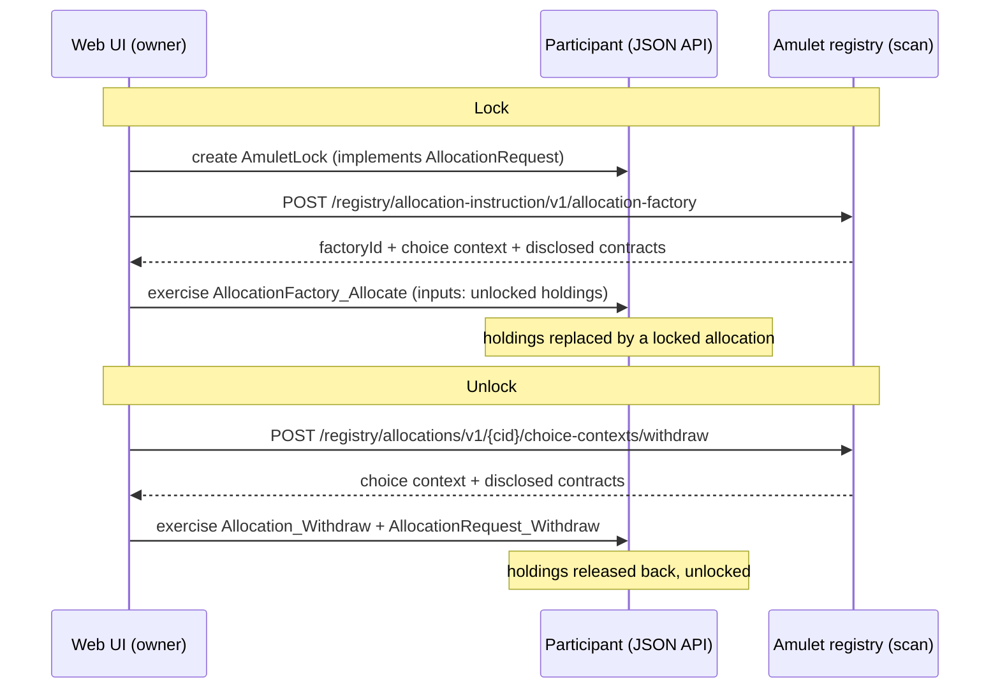

# Amulet Lock — a minimal lock/unlock example app

Lock your Amulet (Canton Coin) on LocalNet and unlock it again, using the
**CIP-56 token standard** — no custody, no escrow. The lock is enforced
on-ledger by the Amulet registry; this app never takes possession of the funds.

Part of the [Canton developer guide](../../README.md). For the patterns distilled
from building this app, see
[allocation lock learnings](../../context/development/cip-56-allocation-lock-learnings.md).

## How it works

A CIP-56 **allocation** locks the holdings that fund it. A "lock" is an
allocation for a transfer leg **from yourself to yourself** that is never
settled — only withdrawn (unlock) or expired.



The DAML side is a single template, [`AmuletLock`](daml/src/AmuletLock.daml),
implementing the `AllocationRequest` interface with the owner as **sender,
receiver, and executor**.

## Prerequisites

| Requirement | Notes |
|-------------|-------|
| **Docker Desktop** | ≥ 8 GB memory; must be **running** before `make up` |
| **LocalNet** | [`localnet/`](../../localnet/) — `cp .env.example .env && make up` |
| **dpm** | Build the DAR: `curl https://get.digitalasset.com/install/install.sh \| sh` |
| **Python 3** | UI server only (`web/serve.py`; stdlib, no pip install) |

First-time LocalNet boot pulls images and can take several minutes. JSON API
auth is on by default (unsafe JWT) — the UI server mints tokens for you; see
[localnet/README.md](../../localnet/README.md#json-api-auth-default).

## Quickstart (from a cold machine)

```bash
# 1. Start LocalNet (from repo root)
cd localnet && cp .env.example .env && make up

# 2. Build and deploy the example (app-user participant on :2975)
cd ../examples/amulet-lock
make build
make deploy
make serve
```

Open **http://localhost:8800**. In the UI:

1. **Tap 100 CC** — LocalNet faucet (only needed if balance is zero).
2. Enter **amount** and **lock duration** → **Lock**.
3. **Unlock** releases holdings early; otherwise the registry releases them after
   `lockedUntil`.

### Make targets

| Target | Description |
|--------|-------------|
| `make build` | Compile DAR (fetches LocalNet bundle for interface DARs if needed) |
| `make deploy` | Upload DAR to app-user JSON API (`:2975`) |
| `make serve` | Web UI + API proxy on `http://localhost:8800` |
| `make clean` | Remove `daml/.daml` build artifacts |

### Tear down

```bash
# Stop the UI server (Ctrl-C in the serve terminal), then:
cd ../../localnet && make down     # stop containers, keep volumes
make clean                         # optional: delete bundle + volumes
```

## What this demonstrates

- **`AllocationRequest` in app DAML** — one template, three interface choices.
- **Registry write path** — `allocation-factory` + `AllocationFactory_Allocate`;
  `choice-contexts/withdraw` + `Allocation_Withdraw`.
- **JSON Ledger API v2** — interface-filtered ACS (`Holding`, `Allocation`);
  `submit-and-wait` with **disclosed contracts** from the registry.
- **Validator API** — wallet onboard + `tap` on LocalNet.
- **UTXO hygiene** — UI refreshes holdings before every lock/unlock (stale ids
  cause HTTP 404).

## Layout

| Path | Purpose |
|------|---------|
| [`daml/src/AmuletLock.daml`](daml/src/AmuletLock.daml) | `AllocationRequest` implementation |
| [`daml/daml.yaml`](daml/daml.yaml) | `data-dependencies` on LocalNet bundle interface DARs |
| [`web/index.html`](web/index.html), [`web/app.js`](web/app.js) | Single-page UI (vanilla JS) |
| [`web/serve.py`](web/serve.py) | Static server + JSON/validator/scan proxy + JWT mint |
| [`Makefile`](Makefile) | `build`, `deploy`, `serve`, `clean` |

## LocalNet endpoints used

| Service | URL |
|---------|-----|
| Example UI | `http://localhost:8800` |
| app-user JSON API | `http://localhost:2975` (proxied as `/proxy/json/`) |
| app-user validator API | `http://localhost:2903` (proxied as `/proxy/validator/`) |
| Scan / Amulet registry | `http://scan.localhost:4000` (proxied as `/proxy/scan/`) |
| app-user wallet UI | `http://wallet.localhost:2000` |

## Troubleshooting

| Symptom | Fix |
|---------|-----|
| `Contract could not be found` on Lock | Holdings are UTXOs — refresh the page or click **Refresh**, then Lock again |
| `HTTP 401` on API calls | LocalNet auth is on; use the UI server (it mints JWTs) or see [local-dev-stack.md](../../context/development/local-dev-stack.md#json-api-auth) |
| `make build` fails — no interface DARs | Run `make -C ../../localnet fetch` first |
| `make deploy` permission error | Deploy uses `ledger-api-user` JWT internally; app commands use `app-user` |
| UI cannot connect | Ensure LocalNet is up (`make -C localnet status`) and Docker is running |
| `*.localhost` does not resolve | Add `127.0.0.1 wallet.localhost scan.localhost` to `/etc/hosts` |

## Notes and limitations

- LocalNet **unsafe JWT** only; production apps use OAuth2 and the Wallet SDK.
- `allocateBefore` is 10 minutes ahead; unfunded lock requests expire — cancel and
  retry.
- Locked amulet still accrues holding fees; UI shows face values.
- After `lockedUntil`, registry automation can release the lock without your UI.

## Further reading

- [CIP-56 allocation lock learnings](../../context/development/cip-56-allocation-lock-learnings.md) — registry APIs, DAML setup, error cheat sheet
- [CIP-56 integration](../../context/development/cip-56-integration.md) — holdings, transfers, pre-approval
- [Ledger API v2 patterns](../../context/development/ledger-api-patterns.md) — ACS, disclosures, stale UTXOs
- [Examples index](../README.md)

## Sources

- [CIP-0056](https://github.com/canton-foundation/cips/blob/main/cip-0056/cip-0056.md)
- [Token standard APIs](https://docs.sync.global/app_dev/token_standard/index.html)
- [decentralized-canton-sync `token-standard/`](https://github.com/digital-asset/decentralized-canton-sync/tree/main/token-standard)
